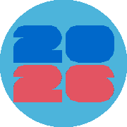
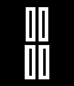
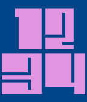
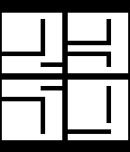

# Pebble Watchfaces

A monorepo of [Rebble](https://rebble.io) / Pebble SDK 3 watchfaces.

```
watchfaces/
  fwc26/    ← World Cup 2026
  lslt/     ← minimalist variable-font animation
tools/
  font/       ← glyph generation scripts
  screenshots/ ← emulator capture + grid compositor
```

---

## fwc26 — World Cup 2026

A watchface inspired by the FWC2026 typeface. Digits are drawn as filled polygons scaled at runtime. Three display modes (logo, overlap, classic) with per-team color themes.

| basalt | chalk |
|--------|-------|
|  |  |
|  |  |
|  |  |

[→ Full grid](watchfaces/fwc26/screenshots/grid.png) · [→ README](watchfaces/fwc26/README.md)

---

## lslt — variable font animation

Digits interpolate between a thin and bold weight as time progresses — hour digits grow bolder over the hour, minute digits over the minute.

| thin | mid | bold |
|------|-----|------|
|  |  |  |

[→ README](watchfaces/lslt/README.md)
