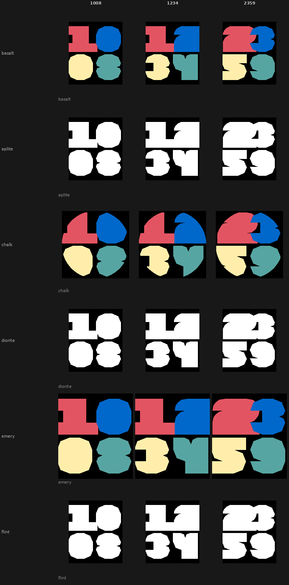

# Claude Fails

A Pebble watchface born as a failed iteration on the road to [fwc26](../fwc26/).

While building fwc26 — a watchface using a custom typeface inspired by the World Cup 2026 typography — an early approach was tried using pre-baked PDC vector resources instead of drawn paths. The font wasn't quite right, the architecture hit its limits, and the approach was eventually abandoned in favour of the path-drawing technique used in fwc26. But the result was interesting enough to keep.

Displays HH:MM in a 2×2 grid. Each digit gets one of four colors from the WC2026 palette: coral red, royal blue, yellow, and teal.

## Platforms

Supports all six Pebble platforms: aplite, basalt, chalk, diorite, emery, flint.

Color platforms show the four-color palette. Black-and-white platforms (aplite, diorite, flint) render in white on black.

## Screenshots

